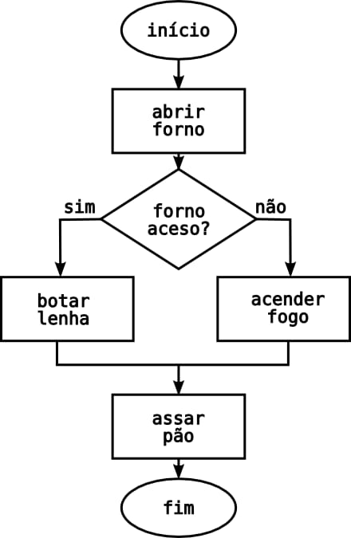

::: {layout="[10,70]"}

Nesta aula você aprenderá os conceitos fundamentais de programação, incluindo o que são programas, lógica de programação, algoritmos, pseudocódigo e variáveis. Estes conceitos são essenciais para começar sua jornada em desenvolvimento de software.

:::

## Vídeo de Apoio Geral

<iframe width="514" height="289" src="https://www.youtube-nocookie.com/embed/gMxQ8vxH9Vk" title="Conceitos Importantes" frameborder="0" allow="accelerometer; clipboard-write; encrypted-media; gyroscope; picture-in-picture" allowfullscreen></iframe>

## 1.1 Programa

É um conjunto de instruções que descrevem uma tarefa a ser realizada pelo computador.

## 1.2 Lógica de Programação

A lógica de programação é a organização de ideias e instruções de forma lógica, com o objetivo de resolver problemas ou realizar tarefas de maneira automatizada. Ou seja, é o raciocínio usado para escrever um código que o computador consiga entender. Com a lógica de programação, conseguimos pensar passo a passo em uma solução e depois transformá-la em instruções.

<iframe width="514" height="289" src="https://www.youtube-nocookie.com/embed/JaTf3dhx464" title="Lógica de Programação" frameborder="0" allow="accelerometer; clipboard-write; encrypted-media; gyroscope; picture-in-picture" allowfullscreen></iframe>

## 1.3 Algoritmos
::: {layout="[70,0]"}

:::
Os algoritmos são uma sequência de passo a passo, com a finalidade de resolver um problema ou executar uma tarefa.

<iframe width="514" height="289" src="https://www.youtube-nocookie.com/embed/Ohi-MGlBEws" title="Algoritmos" frameborder="0" allow="accelerometer; clipboard-write; encrypted-media; gyroscope; picture-in-picture" allowfullscreen></iframe>

## 1.4 Pseudocódigo
::: {layout="[70,70]"}

O pseudocódigo é uma forma de escrever um algoritmo usando uma linguagem similar à linguagem humana. Ela serve para planejar o raciocínio antes de programar.
:::

<iframe width="514" height="289" src="https://www.youtube-nocookie.com/embed/g_xl2osowC0" title="Pseudocódigo" frameborder="0" allow="accelerometer; clipboard-write; encrypted-media; gyroscope; picture-in-picture" allowfullscreen></iframe>

## 1.5 Variáveis e Constantes

A variável é um objeto que armazena os dados que precisamos no algoritmo, e o seu valor pode ser alterado durante a execução do programa. Já a constante, é uma valor que é pré definido no algoritmo. Ou seja, ela não muda na execução do programa.

<iframe width="514" height="289" src="https://www.youtube-nocookie.com/embed/cLbUYVfw_ZI" title="Variáveis e Constantes" frameborder="0" allow="accelerometer; clipboard-write; encrypted-media; gyroscope; picture-in-picture" allowfullscreen></iframe>
