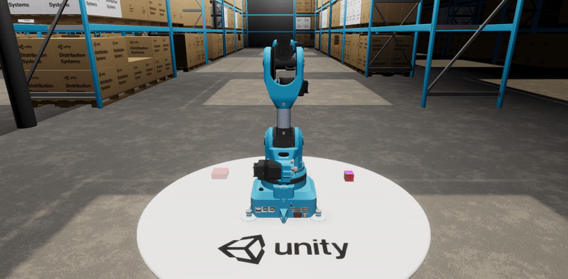

::: {layout="[20,70]"}
<!-- Espaço reservado para imagem -->

:::
## O que é?

A modelagem computacional ou simulação consiste na criação de modelos virtuais de robôs em softwares de simulação, permitindo testar comportamentos e validar ideias sem a necessidade de hardware físico. Essa abordagem é fundamental para prever desafios, otimizar soluções e economizar recursos durante o processo de desenvolvimento.

### Principais ferramentas :

- **MATLAB/Simulink:** Muito utilizado para modelagem, simulação e análise de sistemas dinâmicos.
- **Gazebo:** Simulador 3D amplamente integrado ao ROS (Robot Operating System).
- **V-REP (CoppeliaSim):** Ambiente versátil para simulação em robótica, mecatrônica e automação.
- **Webots:** Simulador de robôs aplicado em pesquisa, ensino e indústria.
- **OpenSim:** Especializado em modelagem e simulação de sistemas musculoesqueléticos.
- **Ansys:** Ferramenta de engenharia para simulação multifísica (estrutural, fluidodinâmica, eletromagnética).
- **Abaqus:** Focado em análise por elementos finitos (FEA) para engenharia mecânica e estrutural.
- **Unity:** Engine de jogos cada vez mais utilizada em simulações robóticas e ambientes virtuais devido aos avançados recursos gráficos e de física.
- **ROS (Robot Operating System):** Não é um simulador, mas integra-se a diversas ferramentas para controlar e testar robôs virtuais.

### Simulação no GAZEBO utilizando ROS - 😱ROBO DA TESLA😱

<iframe width="514" height="289" src="https://www.youtube.com/watch?v=e4l5W7ajl5w" title="Estruturas de Seleção" frameborder="0" allow="accelerometer; clipboard-write; encrypted-media; gyroscope; picture-in-picture" allowfullscreen></iframe>

### Fazendo um robo para o GAZEBO

<iframe width="514" height="289" src="https://www.youtube.com/watch?v=_qQAfTmB5wc" title="Estruturas de Seleção" frameborder="0" allow="accelerometer; clipboard-write; encrypted-media; gyroscope; picture-in-picture" allowfullscreen></iframe>

## Exemplo prático

**Modelagem Computacional/Simulação:**  

>Antes de construir o robô, os alunos utilizam um software de simulação como Unity ou Gazebo para criar um ambiente virtual da biblioteca. Eles programam o robô virtual com os movimentos e velocidades calculados anteriormente, observando como ele se comporta e ajustando o código para evitar colisões e otimizar o percurso. Isso permite que eles "testem" o robô, economizando materiais físicos e tempo.

## Links úteis

- [Gazebo](https://gazebosim.org/)
- [CoppeliaSim (V-REP)](https://www.coppeliarobotics.com/)
- [Webots](https://cyberbotics.com/)
- [MATLAB/Simulink](https://www.mathworks.com/products/simulink.html)
- [Unity](https://unity.com/)
- [OpenSim](https://opensim.stanford.edu/)
- [Ansys](https://www.ansys.com/)
- [Abaqus](https://www.3ds.com/products-services/simulia/products/abaqus/)
- [ROS](https://www.ros.org/)

