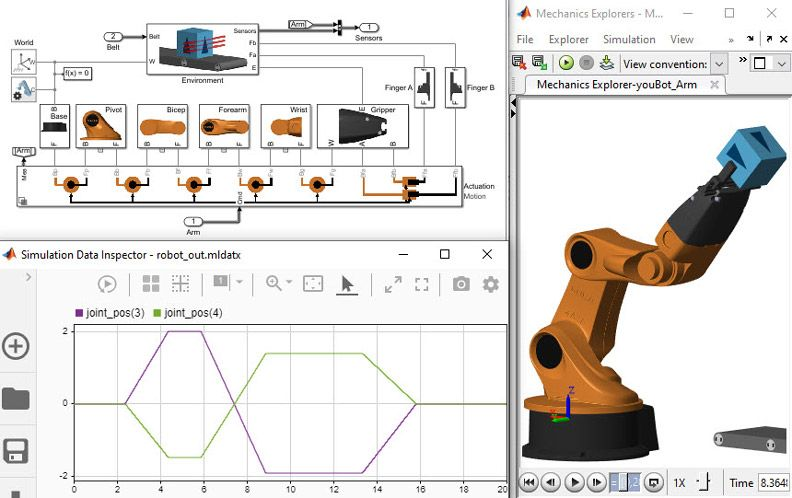

{fig-align="center" width="150px"}

## O que é?

A modelagem matemática envolve o uso de fórmulas e equações para prever ou descrever o comportamento de um robô. É fundamental, por exemplo, para calcular a velocidade, trajetória, força ou outros parâmetros essenciais para o funcionamento eficiente do sistema robótico.

Ferramentas frequentemente utilizadas para modelagem matemática incluem:

- **MATLAB:** Muito usado para cálculos, simulações e modelagem matemática avançada.
- **Python:** Com bibliotecas como NumPy, SciPy e SymPy para manipulação numérica e simbólica.
- **Simulink:** Integrado ao MATLAB, ideal para simulação de sistemas dinâmicos.
- **Softwares de CAD/CAE:** SolidWorks, AutoCAD ou ANSYS são exemplos para análises estruturais, simulações mecânicas e cálculos de engenharia.

::: {layout="[1,70]"}

<!-- Espaço reservado para imagem -->

:::

## Exemplo prático

**Modelagem Matemática:**  

> Após a modelagem conceitual e a simulação, os alunos precisam determinar qual velocidade o robô deve ter para se mover de um ponto a outro sem colidir com obstáculos. Utilizando uma régua e um cronômetro, calculam a distância entre a mesa de coleta e as prateleiras. Com base no tempo desejado para o deslocamento, aplicam a fórmula:

> **Velocidade = Distância / Tempo**

> Assim, determinam a velocidade ideal dos motores do robô para realizar a tarefa de forma eficiente e segura.

## Links úteis

- [MATLAB](https://www.mathworks.com/products/matlab.html)
- [Simulink](https://www.mathworks.com/products/simulink.html)
- [NumPy](https://numpy.org/)
- [SciPy](https://scipy.org/)
- [SymPy](https://www.sympy.org/)
- [SolidWorks](https://www.solidworks.com/)
- [AutoCAD](https://www.autodesk.com/products/autocad/overview)
- [ANSYS](https://www.ansys.com/)
