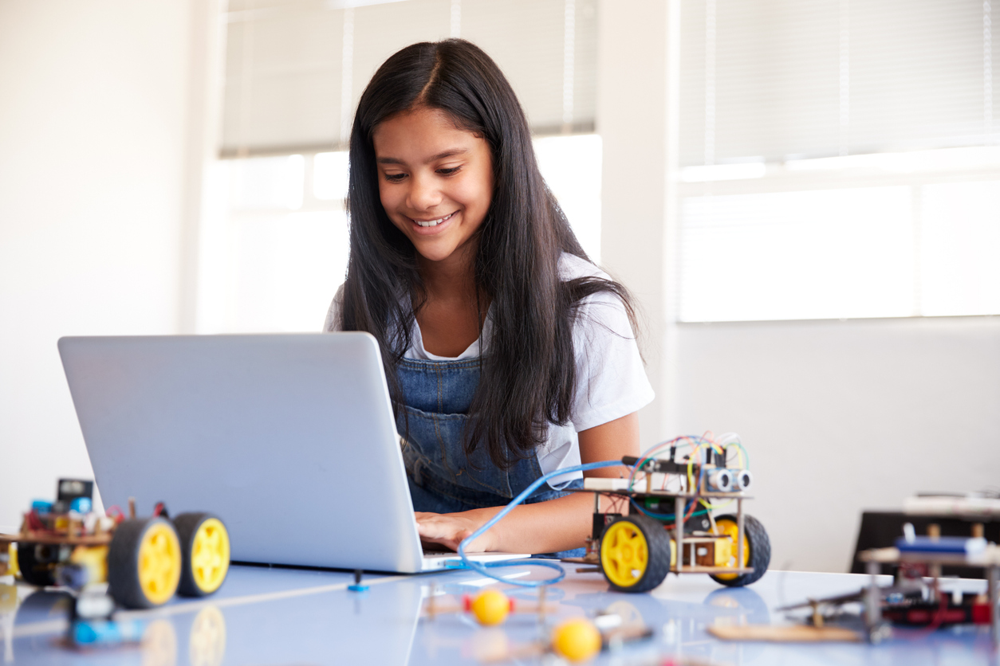
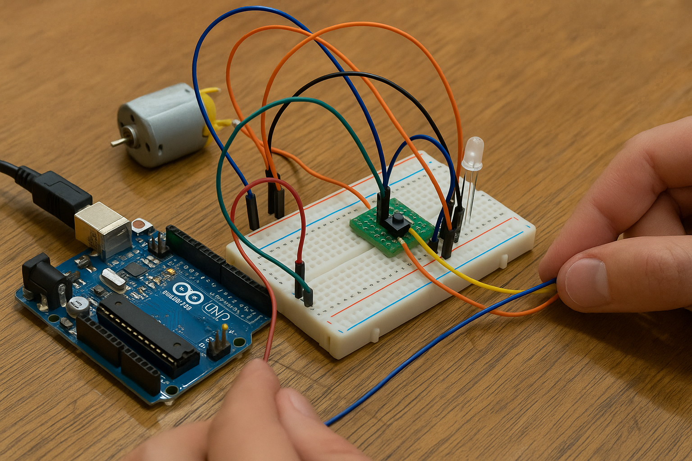

<!-- Espaço reservado para imagem -->
{fig-align="center"}

### Modelagem Baseada em Prototipagem Rápida

A modelagem baseada em prototipagem rápida é uma abordagem "mão na massa", onde os alunos criam, testam e refinam protótipos de forma interativa. É comum que esse seja o primeiro contato dos estudantes com a modelagem, pois permite transformar ideias em soluções tangíveis rapidamente, contextualizando conceitos de robótica educacional na resolução de problemas reais.

Essa metodologia se destaca por ser prática e iterativa, estimulando o envolvimento ativo dos alunos no desenvolvimento de produtos ou soluções. Ao invés de seguir um fluxo linear, incentiva-se a criação, o teste e o aprimoramento contínuo dos protótipos. O foco principal é transformar ideias conceituais em objetos concretos que podem ser avaliados e refinados rapidamente.

#### Benefícios da abordagem

- **Aprendizagem Ativa e Experiencial:** Os estudantes aprendem fazendo, fortalecendo tanto a compreensão teórica quanto o desenvolvimento de habilidades práticas.
- **Detecção Precoce de Problemas:** Falhas e desafios são identificados logo no início, reduzindo custos e tempo associados a revisões posteriores.
- **Feedback Constante e Melhoria Contínua:** O ciclo iterativo permite incorporar feedback dos usuários e stakeholders, garantindo que o produto final atenda às necessidades reais.
- **Estímulo à Criatividade e Resolução de Problemas:** A flexibilidade da prototipagem rápida incentiva a experimentação e soluções inovadoras.
- **Desenvolvimento de Habilidades Colaborativas:** Geralmente realizada em equipes, promove a comunicação e colaboração entre os estudantes.
- **Redução de Riscos:** Testar ideias em pequena escala antes do desenvolvimento completo minimiza significativamente os riscos do projeto.

<!-- Espaço reservado para imagem -->
{fig-align="center"}

## Exemplo prático

**Modelagem Baseada em Prototipagem Rápida**  

> Durante o desenvolvimento do robô, eles decidem criar um "braço personalizado" com uma garra adaptável usando impressão 3D. Os alunos percebem que antes de desenvolver o prototipo físico o ideal testar os principios de funcionamento elétricos e eletrônicos para segurar os conceitos visto nos livros. Para isso, começam desenhando o circuito eletrônico no Tinkercad, em seguida reúnem os componentes físicos para montagem e testes iniciais. Esse processo permite testar e ajustar rapidamente o projeto conforme necessário.

## Links úteis

- [Tinkercad](https://www.tinkercad.com/)
- [Fusion 360](https://www.autodesk.com/products/fusion-360/overview)
- [FreeCAD](https://www.freecad.org/)
- [Ultimaker Cura](https://ultimaker.com/software/ultimaker-cura/)
- [Thingiverse](https://www.thingiverse.com/)
- [Arduino](https://www.arduino.cc/)
- [PrusaPrinters](https://www.printables.com/)