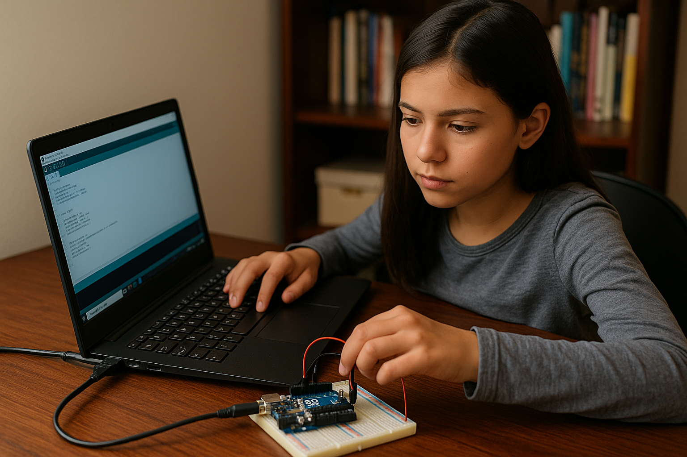

## O que é?
### Modelagem de Sistemas Embarcados

A modelagem de sistemas embarcados integra hardware e software de maneira harmoniosa para conceber e desenvolver sistemas autônomos. O foco principal, especialmente no contexto da robótica educacional, é a criação de robôs autônomos capazes de interagir com o ambiente e tomar decisões de forma independente. No entanto, vale lembrar que essa área vai muito além e é altamente valorizada na indústria, estando presente em diversos setores.

Para implementar sistemas embarcados, utilizam-se microcontroladores amplamente conhecidos, como Arduino e Raspberry Pi, que atuam como o "cérebro" do sistema, controlando suas funcionalidades e comportamentos.
::: {layout="[30,70]"}
<!-- Espaço reservado para imagem -->

:::

### Modelagem de PCB

A modelagem de PCB (Placa de Circuito Impresso) é uma etapa fundamental no desenvolvimento de sistemas embarcados. Ela consiste em planejar, desenhar e validar o circuito eletrônico que irá integrar todos os componentes do projeto, como microcontroladores, sensores, atuadores e conexões de alimentação.

::: {layout="[30,70]"}
<!-- Espaço reservado para imagem -->

:::

O processo começa com a criação do esquema elétrico, onde são definidos todos os componentes e suas ligações. Em seguida, utiliza-se um software de CAD eletrônico (como KiCad, Fritzing ou Eagle) para transformar o esquema em um layout de placa, organizando os componentes e roteando as trilhas que farão as conexões elétricas. Durante essa etapa, é possível simular o funcionamento do circuito, identificar possíveis erros e otimizar o design para facilitar a montagem e manutenção.

A modelagem de PCB permite:

- Reduzir erros de montagem e conexões soltas.
- Otimizar o espaço físico do projeto.
- Facilitar a replicação e manutenção do sistema.
- Garantir maior confiabilidade e desempenho do circuito.

Somente após a validação virtual do projeto, a placa é fabricada e os componentes são soldados, resultando em um sistema embarcado compacto, funcional e pronto para ser integrado ao restante do projeto.

## Altium Designer Tutorial 
<iframe width="514" height="289" src="https://youtu.be/xjJpiMlldoI?si=48puWZQ6sphv5czV" title="Introdução à Modelagem 3D para Robótica" frameborder="0" allow="accelerometer; clipboard-write; encrypted-media; gyroscope; picture-in-picture" allowfullscreen></iframe>

## Atividade bonus
<iframe width="514" height="289" src="https://youtu.be/jxiaHpoSUno?si=DJET5qp5XjUISA8o" title="Introdução à Modelagem 3D para Robótica" frameborder="0" allow="accelerometer; clipboard-write; encrypted-media; gyroscope; picture-in-picture" allowfullscreen></iframe>
## Exemplo prático

**Modelagem de PCB com Sistemas Embarcados:**  

> Na etapa final do projeto, o robô físico é completamente integrado. Os alunos conectam motores, sensores e o braço impresso em 3D a uma placa Arduino. Em seguida, escrevem o código final na Arduino IDE, responsável por controlar todas as ações do robô – desde a leitura dos sensores de cor e distância, até o movimento dos motores e o acionamento do braço para pegar e soltar os livros. Com o sucesso do primeiro prototipo, os alunos decidem modelar em um software 3D uma placa de circuito impresso (PCB) para organizar melhor os componentes eletrônicos e facilitar a montagem e modularização do projeto. Eles utilizam o KiCad para desenhar o circuito, garantindo que todos os componentes estejam conectados corretamente. Após a fabricação da PCB, realizam testes finais para garantir que o robô funcione conforme o esperado.

Ao final, o robô é testado na biblioteca real, possibilitando que os alunos percebam como cada etapa da modelagem foi essencial para o sucesso do projeto – desde a concepção inicial até a execução física e aprimorada.

## Links úteis

- [Arduino](https://www.arduino.cc/)
- [Raspberry Pi](https://www.raspberrypi.org/)
- [ESP32](https://www.espressif.com/en/products/socs/esp32)
- [MicroPython](https://micropython.org/)
- [PlatformIO](https://platformio.org/)
- [Arduino IDE](https://www.arduino.cc/en/software)