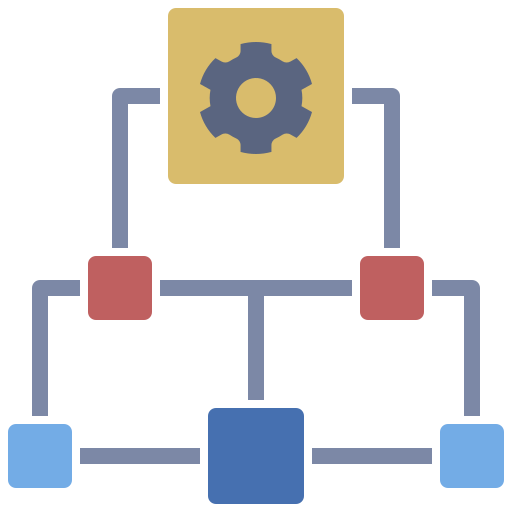

::: {layout="[30,70]"}

Nesta aula você aprenderá sobre estruturas de repetição, que são usadas quando precisamos executar um bloco de código várias vezes. Você conhecerá os loops FOR e WHILE, entendendo quando usar cada um deles.

:::

## Introdução às Estruturas de Repetição

As estruturas de repetição são fundamentais quando precisamos executar um bloco de código múltiplas vezes de forma automatizada.

<iframe width="514" height="289" src="https://www.youtube-nocookie.com/embed/RlgdACEgA8c" title="Estruturas de Repetição" frameborder="0" allow="accelerometer; clipboard-write; encrypted-media; gyroscope; picture-in-picture" allowfullscreen></iframe>

## 4.1 Loop FOR

O loop FOR é utilizado quando sabemos previamente o número de repetições que queremos executar.

<iframe width="514" height="289" src="https://www.youtube-nocookie.com/embed/zjiEhZ0iwo4" title="FOR em Python" frameborder="0" allow="accelerometer; clipboard-write; encrypted-media; gyroscope; picture-in-picture" allowfullscreen></iframe>

## 4.2 Loop WHILE

O loop WHILE continua executando enquanto uma determinada condição for verdadeira.

<iframe width="514" height="289" src="https://www.youtube-nocookie.com/embed/bcIvlP55IR8" title="WHILE em Python" frameborder="0" allow="accelerometer; clipboard-write; encrypted-media; gyroscope; picture-in-picture" allowfullscreen></iframe>

