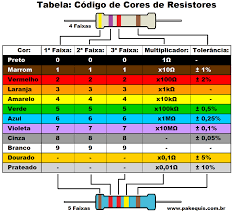
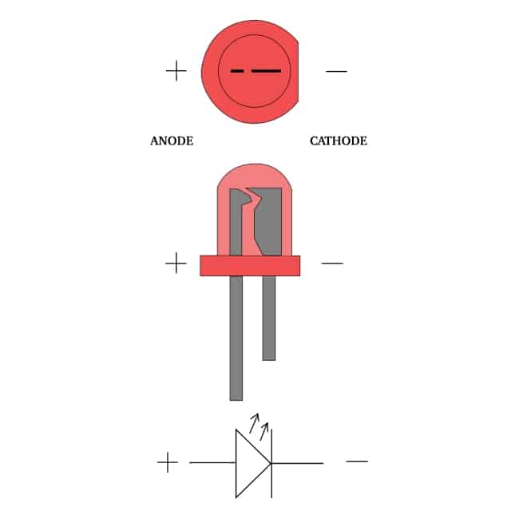
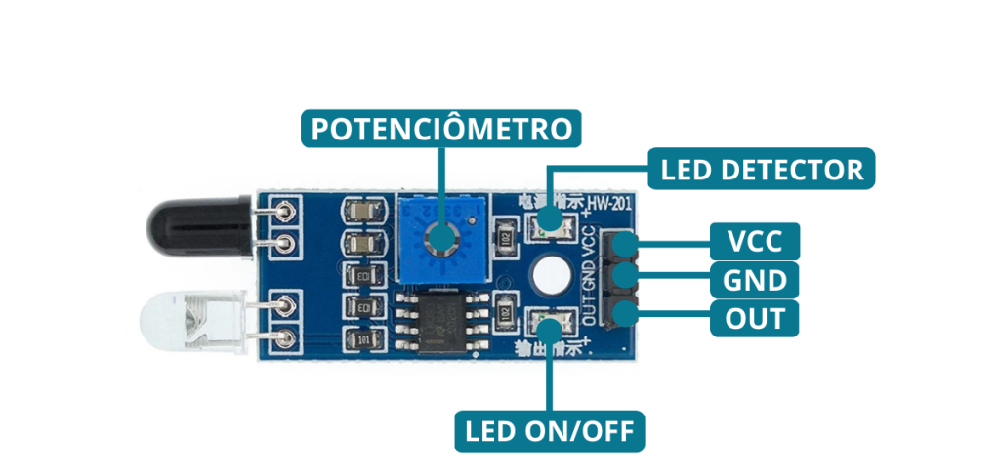

::: {layout="[30,70]"}

Este tópico oferece uma exploração abrangente sobre os componentes eletrônicos, abordando suas classificações, funções e características principais. Os Componentes Eletrônicos são a estrutura de um circuito elétrico ou eletrônico, desde os mais simples aos mais complexos. Podem ser definidos como todo dispositivo que transmite corrente elétrica através de um condutor ou semicondutor.

:::

## Resistores

Como os resistores são muito pequenos para terem seus valores impressos, eles usam um sistema de faixas coloridas para indicar seu valor de resistência, multiplicador e tolerância. Por exemplo, um resistor com as faixas Laranja, Laranja, Marrom e Dourado corresponde a 330 ohms com ±5% de tolerância. Caso haja dúvida, o uso de um multímetro é recomendado para obter uma leitura precisa do valor.

<iframe width="514" height="289" src="https://www.youtube-nocookie.com/embed/IWkPwoeCDy0" title="Resistores" frameborder="0" allow="accelerometer; clipboard-write; encrypted-media; gyroscope; picture-in-picture" allowfullscreen></iframe>

Como podemos observar também na imagem a seguir a tabela de cores dos resistores:

::: {layout="[70,0]"}

:::

## LED
::: {layout="[70,0]"}

:::

LED (do inglês, Light Emitting Diode) é um diodo emissor de luz, sendo basicamente é uma lâmpada que consome pouca energia. O LED, assim como alguns componentes, possui um lado positivo “+” e um lado negativo “-“, essa característica também é conhecida como polaridade. Para esses componentes, se ligar de modo invertido, ele não irá funcionar e pode até acabar danificando. A haste (perna) maior do LED é o lado positivo e a menor é o lado negativo. Você pode ver também pelo lado mais achatado, que é o lado negativo enquanto o lado arredondado é o positivo.

## Sensor infravermelho

É um dispositivo eletrônico que emite e/ou detecta radiação infravermelha com o intuito de revelar alguns aspectos do ambiente a seu redor. Esses sensores podem ser utilizados para identificar obstáculos, detectar movimento, medir o calor de um objeto, ler de código de barras, em alarmes de passagem, entre outros. O sensor de obstáculo reflexivo infravermelho IR possui dois LEDs infravermelho: um LED emissor infravermelho (de cor transparente), que emite um feixe de luz numa frequência não visível a olho nu, e um receptor fototransistor (de cor preta), que captura o feixe de luz emitido pelo infravermelho. Estes dois LEDs operam em conjunto. Quando a luz emitida choca em algum obstáculo próximo ocorre a reflexão da luz e o fototransistor a detecta. A cor e o material do objeto podem interferir no funcionamento do sensor de obstáculo reflexivo infravermelho IR.

::: {layout="[70,0]"}

:::

Os pinos e componentes do sensor de obstáculo reflexivo infravermelho IR possuem as seguintes funções:

- VCC: Pino de alimentação do sensor com tensão entre 3,3V ~ 5V;
- GND: Pino de aterramento do sensor;
- OUT: Pino de saída digital do sensor;
- LED ON/OFF: LED que indica quando o sensor está ligado (ON) ou desligado (OFF);
- LED DETECTOR: LED que indica quando ocorre a detecção de um objeto pelo sensor;
- POTENCIÔMETRO: Potenciômetro de ajuste da sensibilidade do sensor.

<iframe width="514" height="289" src="https://www.youtube-nocookie.com/embed/ZlifLRBmaZg" title="Sensor Infravermelho IR" frameborder="0" allow="accelerometer; clipboard-write; encrypted-media; gyroscope; picture-in-picture" allowfullscreen></iframe>

## Sensor ultrassônico

É um dispositivo que emite ondas sonoras de alta frequência. Essas ondas se propagam pelo ar até encontrarem uma barreira, como uma parede ou uma porta. Quando as ondas encontram um objeto, elas são refletidas de volta para o sensor. O sensor mede o tempo que levou para as ondas serem refletidas e usa essa informação para determinar a distância do objeto. O sensor HC-SR04 é composto de três partes principais:

Transmissor Ultrassônico – Emite as ondas ultrassônicas que serão refletidas pelos obstáculos;
Um receptor – Identifica o eco do sinal emitido pelo transmissor;
Circuito de controle – Controla o conjunto transmissor/receptor, calcula o tempo entre a emissão e recepção do sinal.

::: {layout="[70,0]"}

Na figura podemos observar os quatro pinos do sensor HC-SR04. Temos um pino de VCC, alimentado com 5V, um GND, e os dois pinos de controle e leitura do sensor: O Trigger, no qual nós aplicamos o sinal para comandar o envio dos pulsos ultrassônicos, e o Echo, que retorna para o Arduino os pulsos com o tempo de duração entre o envio e recepção do sinal de retorno. A corrente elétrica de operação do sensor é de 15mA, portanto é uma aplicação de baixo consumo energético.
:::

<iframe width="514" height="289" src="https://www.youtube-nocookie.com/embed/J_bUAs-VXA8" title="Sensor Ultrassônico" frameborder="0" allow="accelerometer; clipboard-write; encrypted-media; gyroscope; picture-in-picture" allowfullscreen></iframe>

## DC Motor

Os motores são componentes indispensáveis em projetos de automação e robótica que utilizam Arduino. São eles os responsáveis pela conversão de energia elétrica em movimento mecânico, permitindo que artefatos robóticos, máquinas e outros dispositivos realizem movimentos. Os motores DC (corrente contínua) são ideais para projetos que exigem um controle simples e eficaz de velocidade. Eles são bastante versáteis e podem ser utilizados em uma gama de aplicações devido à sua capacidade de operar em diferentes velocidades e direções.

<iframe width="514" height="289" src="https://www.youtube-nocookie.com/embed/ApuPtPZeUf0" title="DC Motor" frameborder="0" allow="accelerometer; clipboard-write; encrypted-media; gyroscope; picture-in-picture" allowfullscreen></iframe>

